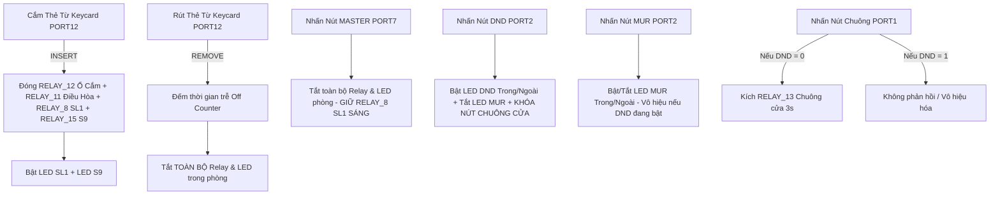

# TÀI LIỆU CẤU TRÚC CHÂN GPIO, LOGIC VẬN HÀNH & NGUYÊN TẮC HỆ THỐNG RCU STM32F103
**Dự án**: RCU PHÚ QUỐC KINGROOM (STM32F103VCT6 - PlatformIO / VSCode)  
**Phiên bản**: FIX2LED (Bản cập nhật chuẩn lắp đặt công trình)

---

## I. FILE CẤU HÌNH TRUNG TÂM `include/pin_config.h`
Toàn bộ các khai báo số chân GPIO (Input, Output, IC dịch 74HC595, MOSFET, RS485) đã được tập trung vào duy nhất file header:
👉 [`include/pin_config.h`](file:///c:/Users/nguyentin/Desktop/Project_Reall/STM32F103/PQ-KINGROOM-VSCode/include/pin_config.h)

**Quy tắc chỉnh sửa nhanh khi gặp tình huống cấp bách:**
- Nếu cần **đổi chân công tắc Input** hoặc **chân LED Output**: Chỉ cần mở file `pin_config.h` và sửa tên Port/Pin ở Macro tương ứng.
- **Không cần sửa code logic** trong `src/botrungtam.c` hay `src/init.c` khi chỉ thay đổi chân phần cứng.

---

## II. MA TRẬN SƠ ĐỒ CHÂN PHẦN CỨNG (HARDWARE PINOUT MATRIX)

### 1. Hệ Thống Điều Khiển IC Dịch Shift Register 74HC595 (Kích Relay 32-bit)
| Tên Tín Hiệu | Chân STM32 | Chức Năng |
| :--- | :--- | :--- |
| `DS` | **PD2** | Chân dữ liệu Data (Serial Data Input) |
| `OE` | **PD1** | Chân cho phép xuất đầu ra Output Enable (Active Low) |
| `ST_CP` | **PD0** | Chân xung Latch / Chốt dữ liệu (Storage Clock) |
| `SH_CP` | **PC12** | Chân xung Clock dịch dữ liệu (Shift Clock) |

### 2. Kích MOSFET & Truyền Thông RS485 / Đèn Báo Bo
| Tên Tín Hiệu | Chân STM32 | Hướng | Chức Năng Chi Tiết |
| :--- | :--- | :--- | :--- |
| `duphong8_C14` | **PC14** | Output | Kích MOSFET IRF9530 nguồn 12V cấp Relay |
| `duphong9_C15` | **PC15** | Output | Nguồn dự phòng 12V |
| `DE1` | **PA11** | Output | Điều hướng RS485 Kênh 1 (`1`: Tx, `0`: Rx) |
| `DE4` | **PA15** | Output | Điều hướng RS485 Kênh 4 (`1`: Tx, `0`: Rx) |
| `STAT` | **PA12** | Output | Đèn LED báo trạng thái hệ thống |
| `duphong67_A8` | **PA8** | Output | Đèn LED nhấp nháy báo chu kỳ quét bàn phím (Scan Timer) |

---

### 3. Ma Trận Cổng Công Tắc Bàn Phím (Port 1 - Port 12)

#### Cổng 1 (PORT 1): BẢNG CHUÔNG NGOÀI PHÒNG (BELL OUTSIDE)
- **Vị trí**: Mặt ngoài cửa phòng khách sạn
- **Cấu trúc**: 1 Input Nút Nhấn Chuông, 3 Output LED (MUR, DND, BELL)

| Tên Định Nghĩa | Chân STM32 | Loại Pin | Chức Năng & Liên Động |
| :--- | :--- | :--- | :--- |
| `BUT1_0` | **PE2** | Input | Dự phòng (Chưa dùng) |
| `BUT1_1` | **PE4** | Input | Dự phòng (Chưa dùng) |
| `BUT1_2` | **PE6** | Input | **Nút nhấn Chuông ngoài (BELL)**. Kích **RELAY_13** (Chuông) trong 3 giây khi DND tắt. |
| `LED_1_0` | **PE3** | Output | **LED MUR ngoài phòng**. Sáng màu đỏ/xanh báo dọn phòng. |
| `LED_1_1` | **PE5** | Output | **LED DND ngoài phòng**. Sáng báo Xin đừng làm phiền. |
| `LED_1_2` | **PC13** | Output | **LED BELL ngoài phòng**. Sáng báo vị trí nút chuông. |

---

#### Cổng 2 (PORT 2): BẢNG DND / MUR TRONG PHÒNG (INSIDE)
- **Vị trí**: Bên cạnh cửa ra vào trong phòng

| Tên Định Nghĩa | Chân STM32 | Loại Pin | Chức Năng & Liên Động |
| :--- | :--- | :--- | :--- |
| `BUT2_0` | **PC0** | Input | Dự phòng |
| `BUT2_1` | **PC2** | Input | **Nút MUR (Báo Dọn Phòng)**. Đảo trạng thái `LED_2_1` (Trong) và `LED_1_0` (Ngoài). Vô hiệu hóa khi DND đang bật. |
| `BUT2_2` | **PA0** | Input | **Nút DND (Xin Đừng Làm Phiền)**. Đảo trạng thái `LED_2_2` & `LED_1_2`. Khi bật DND -> Tự động tắt MUR và khóa nút chuông ngoài. |
| `LED_2_0` | **PC1** | Output | Dự phòng |
| `LED_2_1` | **PC3** | Output | **LED MUR trong phòng** |
| `LED_2_2` | **PA1** | Output | **LED DND trong phòng** |

---

#### Cổng 3 (PORT 3): CÔNG TẮC SẢNH SL1 + S9 ENTRANCE
- **Vị trí**: Hành lang sảnh vào phòng

| Tên Định Nghĩa | Chân STM32 | Loại Pin | Điều Khiển Thiết Bị & Relay |
| :--- | :--- | :--- | :--- |
| `BUT3_1` | **PB1** | Input | **Nút SL1 (Đèn Sảnh Lobby)** $\rightarrow$ **RELAY_8** (Physical RL1), LED `LED_3_0` (**PB0**) |
| `BUT3_2` | **PE7** | Input | **Nút S9 (Đèn Tranh Đầu Giường)** $\rightarrow$ **RELAY_15** (Physical RL10), LED `LED_3_2` (**PB2**) |

---

#### Cổng 4 (PORT 4): CÔNG TẮC TOILET S3 + S4 [FIX2LED]
- **Vị trí**: Mặt công tắc trong Toilet chính

| Tên Định Nghĩa | Chân STM32 | Loại Pin | Điều Khiển Thiết Bị & Relay |
| :--- | :--- | :--- | :--- |
| `BUT4_0` | **PE9** | Input | **Nút S3 (Đèn Trần Toilet/Vanity/Bồn Tắm)** $\rightarrow$ **RELAY_9** (Physical RL16), LED `LED_4_0` (**PE8**) |
| `BUT4_1` | **PE11** | Input | **Nút S4 (Đèn Trang Trí Toilet/Hắt Trần)** $\rightarrow$ **RELAY_10** (Physical RL15), LED `LED_4_1` (**PE10**) |

---

#### Cổng 5 (PORT 5): BAN CÔNG & BÀN LÀM VIỆC S7 + S8
- **Vị trí**: Khu vực bàn làm việc / Cửa ra ban công

| Tên Định Nghĩa | Chân STM32 | Loại Pin | Điều Khiển Thiết Bị & Relay |
| :--- | :--- | :--- | :--- |
| `BUT5_0` | **PE13** | Input | **Nút S7 (Đèn Ban Công Balcony)** $\rightarrow$ **RELAY_1** (Physical RL8), LED `LED_5_0` (**PE14**) |
| `BUT5_1` | **PE15** | Input | **Nút S8 (Đèn Downlight Bàn Làm Việc)** $\rightarrow$ **RELAY_16** (Physical RL9), LED `LED_5_1` (**PB10**) |

---

#### Cổng 6 (PORT 6): CÔNG TẮC ĐẢO CHIỀU TOILET S3 SECONDARY
- **Vị trí**: Đầu giường hoặc lối vào phụ Toilet

| Tên Định Nghĩa | Chân STM32 | Loại Pin | Điều Khiển Thiết Bị & Relay |
| :--- | :--- | :--- | :--- |
| `BUT6_0` | **PB11** | Input | **Nút S3 Đảo Chiều (Đèn Trần Toilet)** $\rightarrow$ **RELAY_9** (Physical RL16), Đồng bộ LED `LED_6_0` (**PB12**) |

---

#### Cổng 7 (PORT 7): NÚT MASTER TẮT TOÀN BỘ PHÒNG
- **Vị trí**: Tab đầu giường bên phải

| Tên Định Nghĩa | Chân STM32 | Loại Pin | Điều Khiển & Quy Tắc Vận Hành |
| :--- | :--- | :--- | :--- |
| `BUT7_0` | **PB13** | Input | **Nút MASTER**. Khi nhấn: Tắt tất cả Relay đèn phòng, **duy trì duy nhất RELAY_8 (Đèn sảnh SL1)** mở. |
| `LED_7_0` | **PB14** | Output | **LED MASTER**. Nhấp nháy/báo trạng thái Master. |

---

#### Cổng 8 (PORT 8): ĐẦU GIƯỜNG TRÁI S6 + S11 (BEDSIDE LEFT)

| Tên Định Nghĩa | Chân STM32 | Loại Pin | Điều Khiển Thiết Bị & Relay |
| :--- | :--- | :--- | :--- |
| `BUT8_0` | **PB15** | Input | **Nút S6 (Đèn Đọc Sách Trái)** $\rightarrow$ **RELAY_2** (Physical RL7), LED `LED_8_0` (**PD8**) |
| `BUT8_1` | **PD9** | Input | **Nút S11 (Đèn Ngủ Chân Tủ Đầu Giường)** $\rightarrow$ **RELAY_14** (Physical RL11), LED `LED_8_1` (**PD10**) |

---

#### Cổng 9 (PORT 9): ĐẦU GIƯỜNG TRÁI S1 + S2 (BEDSIDE LEFT)

| Tên Định Nghĩa | Chân STM32 | Loại Pin | Điều Khiển Thiết Bị & Relay |
| :--- | :--- | :--- | :--- |
| `BUT9_0` | **PD11** | Input | **Nút S1 (Đèn Minibar & Hành Lý)** $\rightarrow$ **RELAY_7** (Physical RL2), LED `LED_9_0` (**PD12**) |
| `BUT9_1` | **PD13** | Input | **Nút S2 (Đèn Hắt Trần Phòng Ngủ)** $\rightarrow$ **RELAY_6** (Physical RL3), LED `LED_9_1` (**PD14**) |

---

#### Cổng 10 (PORT 10): ĐẦU GIƯỜNG PHẢI S5 + S11 (BEDSIDE RIGHT)

| Tên Định Nghĩa | Chân STM32 | Loại Pin | Điều Khiển Thiết Bị & Relay |
| :--- | :--- | :--- | :--- |
| `BUT10_0` | **PD15** | Input | **Nút S5 (Đèn Đọc Sách Phải)** $\rightarrow$ **RELAY_3** (Physical RL6), LED `LED_10_0` (**PC6**) |
| `BUT10_1` | **PC7** | Input | **Nút S11 (Đèn Ngủ Chân Tủ Đầu Giường)** $\rightarrow$ **RELAY_14** (Physical RL11), LED `LED_10_1` (**PC8**) |

---

#### Cổng 11 (PORT 11): ĐẦU GIƯỜNG PHẢI S1 + S2 ĐẢO CHIỀU (BEDSIDE RIGHT)

| Tên Định Nghĩa | Chân STM32 | Loại Pin | Điều Khiển Thiết Bị & Relay |
| :--- | :--- | :--- | :--- |
| `BUT11_0` | **PB6** | Input | **Nút S1 Đảo Chiều (Minibar/Hành lý)** $\rightarrow$ **RELAY_7**, Đồng bộ LED `LED_11_0` (**PB7**) |
| `BUT11_1` | **PB8** | Input | **Nút S2 Đảo Chiều (Hắt trần phòng ngủ)** $\rightarrow$ **RELAY_6**, Đồng bộ LED `LED_11_1` (**PB9**) |

---

#### Cổng 12 (PORT 12): CÔNG TẮC THẺ TỪ (KEYCARD HOLDER)
- **Vị trí**: Khay cắm thẻ từ cạnh cửa chính

| Tên Định Nghĩa | Chân STM32 | Loại Pin | Điều Khiển & Quy Tắc Vận Hành |
| :--- | :--- | :--- | :--- |
| `BUT12_0` | **PE0** | Input | **Tiếp điểm Thẻ Từ Keycard (Contact NC/NO)**. |
| `LED_12_0` | **PE1** | Output | **LED báo vị trí tra Thẻ Từ**. |

---

### 4. Bảng Ánh Xạ Relay Dịch 32-bit Bitmask (74HC595 Relay Output Map)

| Định Nghĩa Code | Giá Trị Bitmask | Chân Relay Vật Lý | Tên Thiết Bị Tải Thực Tế Trong Phòng |
| :--- | :--- | :--- | :--- |
| `RELAY_1` | `0x00000001` | **RL8** | **Đèn S7**: Đèn Ban Công (Balcony Light) |
| `RELAY_2` | `0x00000002` | **RL7** | **Đèn S6**: Đèn Đọc Sách Đầu Giường Trái |
| `RELAY_3` | `0x00000004` | **RL6** | **Đèn S5**: Đèn Đọc Sách Đầu Giường Phải |
| `RELAY_4` | `0x00000008` | **RL5** | Dự phòng |
| `RELAY_5` | `0x00000010` | **RL4** | Dự phòng |
| `RELAY_6` | `0x00000020` | **RL3** | **Đèn S2**: Đèn Hắt Trần Phòng Ngủ |
| `RELAY_7` | `0x00000040` | **RL2** | **Đèn S1**: Đèn Minibar & Đèn Kệ Hành Lý |
| `RELAY_8` | `0x00000080` | **RL1** | **Đèn SL1**: Đèn Sảnh Vừa Vào Cửa (Lobby Light) |
| `RELAY_9` | `0x00000100` | **RL16** | **Đèn S3**: Đèn Trần Toilet + Vanity + Bồn Tắm **[FIX2LED]** |
| `RELAY_10` | `0x00000200` | **RL15** | **Đèn S4**: Đèn Trang Trí Toilet / Vách **[FIX2LED]** |
| `RELAY_11` | `0x00000400` | **RL14** | **Điều Hòa (Air Conditioner - AC Power)** |
| `RELAY_12` | `0x00000800` | **RL13** | **Ổ Cắm Điện Trong Phòng (Sockets Power)** |
| `RELAY_13` | `0x00001000` | **RL12** | **Chuông Cửa (Doorbell Chime)** |
| `RELAY_14` | `0x00002000` | **RL11** | **Đèn S11**: Đèn Ngủ Gầm Tủ Đầu Giường (Nightlight) |
| `RELAY_15` | `0x00004000` | **RL10** | **Đèn S9**: Đèn Chiếu Tranh Đầu Giường |
| `RELAY_16` | `0x00008000` | **RL9** | **Đèn S8**: Đèn Downlight Bàn Làm Việc |

---

## III. CẤU TRÚC LOGIC BẬT/TẮT & QUY TẮC VẬN HÀNH HỆ THỐNG



### Quy Tắc Ưu Tiên (Priority Hierarchy)
1. **THẺ TỪ (KEYCARD)**: Quyền cao nhất. Rút thẻ từ out-of-room sẽ tự động ngắt điện toàn bộ phòng sau khoảng trễ an toàn.
2. **NÚT MASTER**: Tắt toàn bộ hệ thống chiếu sáng sinh hoạt, giữ lại đèn sảnh SL1 để khách không bị tối om.
3. **CHẾ ĐỘ DND (DO NOT DISTURB)**: Khi bật DND, hệ thống tự khóa nút chuông ngoài phòng và xóa trạng thái Dọn phòng (MUR).

---

## IV. ĐOẠN PROMPT AI CHUẨN KHI CẦN SỬA CHÂN & HỆ THỐNG CẤP BÁCH (EMERGENCY AI PROMPT TEMPLATE)

> Khi bạn gặp tình huống gấp tại công trình (ví dụ: chân IO bị chập cháy phải đổi sang chân dự phòng, thêm relay mới, đổi logic nút nhấn), hãy **copy toàn bộ đoạn prompt dưới đây**, điền yêu cầu của bạn vào phần `[ĐIỀN YÊU CẦU]` và gửi cho AI:

```markdown
Bạn là chuyên gia lập trình nhúng STM32F103 RCU điều khiển phòng khách sạn Phú Quốc (PQ-KINGROOM).
Dự án của tôi quản lý cấu hình chân phần cứng tập trung tại file `include/pin_config.h` và logic vận hành tại `src/botrungtam.c`.

Tôi đang ở công trình và cần xử lý GẤP tình huống sau:
-------------------------------------------------------------------
[ĐIỀN YÊU CẦU CẤP BÁCH CỦA BẠN VÀO ĐÂY, VÍ DỤ:]
- Ví dụ 1: Chân PB15 (BUT8_0) bị hỏng, hãy chuyển sang dùng chân dự phòng PD7 (duphong88_D7).
- Ví dụ 2: Tôi muốn nút S7 (Port 5) khi nhấn thì đổi sang kích RELAY_4 thay vì RELAY_1.
- Ví dụ 3: Đổi chân điều khiển IC 74HC595 DS từ PD2 sang PC11.
-------------------------------------------------------------------

Yêu cầu thực hiện nghiêm ngặt:
1. Nếu thay đổi chân GPIO (Input hoặc Output), CHỈ CHỈNH SỬA file `include/pin_config.h`. Giữ nguyên tính đóng gói modular, không hardcode số chân vào file khác.
2. Nếu thay đổi logic nút bấm/relay, cập nhật trong `src/botrungtam.c` và đảm bảo giữ nguyên logic an toàn (Keycard, DND/MUR, Master).
3. Cập nhật lại ma trận sơ đồ chân trong `config.md`.
4. Kiểm tra biên dịch dự án bằng PlatformIO CLI đảm bảo SUCCESS 100%.
```

---
*Tài liệu này được tạo tự động và đồng bộ trực tiếp với mã nguồn RCU STM32F103 RCU KingRoom Phú Quốc.*
